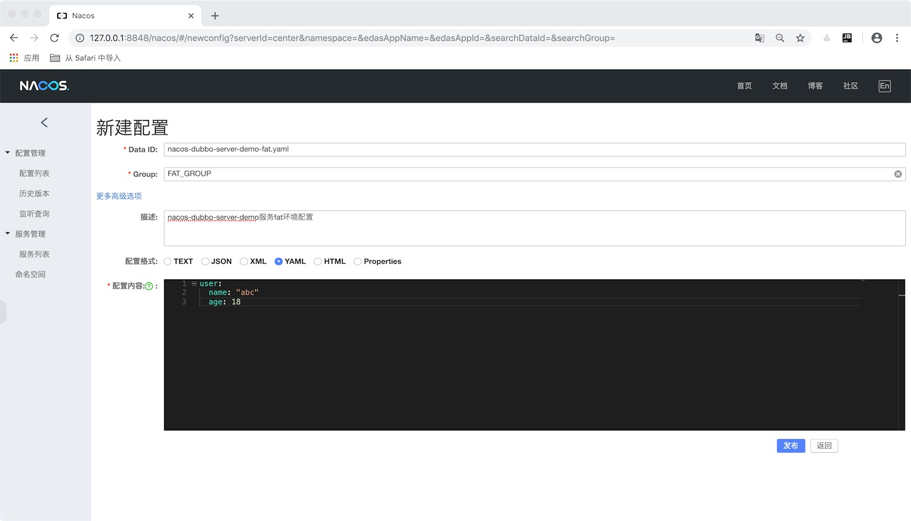

# 1 nacos

## 1.1 nacos部署
使用docker部署nacos: https://github.com/nacos-group/nacos-docker

## 1.2 spring cloud alibaba nacos config
https://github.com/spring-cloud-incubator/spring-cloud-alibaba/blob/master/spring-cloud-alibaba-examples/nacos-example/nacos-config-example/readme-zh.md

## 1.3 nacos使用



dataID:

在 Nacos Config Starter 中，dataId 的拼接格式如下
```
${prefix} - ${spring.profiles.active} . ${file-extension}
```
prefix 默认为 spring.application.name 的值，也可以通过配置项 spring.cloud.nacos.config.prefix来配置。

spring.profiles.active 即为当前环境对应的 profile，详情可以参考 Spring Boot文档

注意，当 activeprofile 为空时，对应的连接符 - 也将不存在，dataId 的拼接格式变成 ${prefix}.${file-extension}

file-extension 为配置内容的数据格式，可以通过配置项 spring.cloud.nacos.config.file-extension来配置。 目前只支持 properties 类型。

group:

group 默认为 DEFAULT_GROUP，可以通过 spring.cloud.nacos.config.group 配置。

配置实例：
```yaml
spring:
  application:
    name: nacos-dubbo-server-demo
  cloud:
    nacos:
      config:
        server-addr: 127.0.0.1:8848
        group: FAT_GROUP
        file-extension: yaml
  profiles:
    active: fat
```

配置中心配置参考: https://www.jianshu.com/p/16ff6d6db0cf


## 1.4 spring cloud alibaba nacos discovery
https://github.com/spring-cloud-incubator/spring-cloud-alibaba/blob/master/spring-cloud-alibaba-examples/nacos-example/nacos-discovery-example/readme-zh.md

> 注意：spring-cloud-alibaba的0.2.1.RELEASE版本一定要使用spring boot 2.1.2.RELEASE和spring cloud Greenwich.RELEASE版本。其他版本可能导致服务无法注册。https://stackoverflow.com/questions/54089663/app-does-not-register-service-with-consul

## 1.5 nacos dubbo
https://nacos.io/zh-cn/docs/use-nacos-with-dubbo.html

目前spring-cloud-alibaba 0.2.2.BUILD-SNAPSHOT版本支持dubbo。

dubbo-spring-boot-starter的集成参考：
https://github.com/apache/incubator-dubbo-spring-boot-project/tree/master/dubbo-spring-boot-samples/dubbo-registry-nacos-samples


## 1.6 zookeeper dubbo
nacos和zookeeper注册中心的使用切换非常容易，只需要在服务提供者和消费者新增dubbo zookeeper注册依赖：
```xml
        <dependency>
            <groupId>com.alibaba</groupId>
            <artifactId>dubbo-registry-zookeeper</artifactId>
            <version>2.6.5</version>
        </dependency>
```
并修改注册中心地址：
```yaml
dubbo:
  application:
    #registry: nacos://127.0.0.1:8848
    registry: zookeeper://127.0.0.1:2181
```


## 1.7 sentinel dubbo
https://github.com/spring-cloud-incubator/spring-cloud-alibaba/blob/master/spring-cloud-alibaba-examples/sentinel-example/sentinel-dubbo-example/readme-zh.md


docker-sentinel:
https://github.com/foxiswho/docker-sentinel
